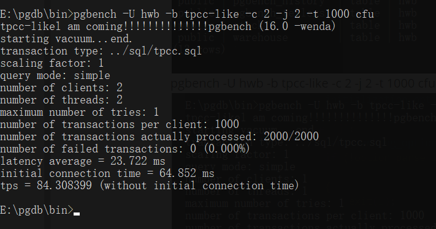

[TOC]

## 摘要

在本次实践中，我进行了数据库性能测试的研究，包括TPCB、TPCC、TPCH和TPCDS几种基准测试。阅读了PostgreSQL中pgbench工具的源代码，并进行了修改，使其能够默认支持TPCC基准测试。TPCB基准测试旨在评估数据库的事务处理能力；TPCC模拟了在线事务处理应用的负载；TPCH用于评估数据库在复杂查询下的性能；而TPCDS则模拟了数据仓库应用的工作负载。

修改pgbench工具包括：内置TPCC测试的SQL脚本和调整建表操作，以支持TPCC数据表的初始化；重构-b参数的解析逻辑使其能够针对tpcc触发对应的测试程序；以及其他的一些牵连操作，如重新初始化需要删除旧表、执行测试命令前需要先进行vacuum操作等。

## 背景

### pgbench

**TPC-C**是经典的衡量在线事务处理（OLTP）系统性能和可伸缩性的基准测试规范。常见的开源数据库的基准测试工具有benchmarksql、 sysbench等，PostgreSQL自带运行基准测试的简单程序**pgbench**。pgbench是一个类**TPC-B** 的基准测试工具，可以执行内置的测试脚本，也可以自定义脚本文件。

### tpcc及其他基准测试

#### TPC-C

- **描述**: TPC-C（Transaction Processing Performance Council - Benchmark C）是一个测量OLTP系统性能的基准测试。它模拟一个具有多个用户同时进行交易处理的零售应用环境。
- **特点**: 主要衡量事务吞吐量、每个事务的平均响应时间以及数据库管理系统在多用户并发操作下的表现。
- **应用**: 用于比较不同数据库管理系统在处理大量并发事务时的性能，通常用于优化数据库架构和硬件配置。

#### TPC-H

- **描述**: TPC-H是用于决策支持系统（DSS）的基准测试。它模拟了复杂的查询和大规模数据分析场景。
- **特点**: 通过模拟复杂的数据分析查询来评估数据库系统在处理决策支持查询时的性能。
- **应用**: 适用于评估数据仓库和大数据系统的性能，帮助优化查询处理和数据分析速度。

#### TPC-DS

- **描述**: TPC-DS（Decision Support Benchmark）是用于评估决策支持系统（DSS）性能的基准测试。与TPC-H类似，它专注于模拟复杂的查询和大规模数据分析场景。
- **特点**: TPC-DS相比于TPC-H更为细致和现代化，包含更多维度和更复杂的查询，以更真实地模拟企业数据分析的工作负载。
- **应用**: 用于评估数据仓库和大数据系统在处理复杂决策支持查询时的性能表现，帮助优化查询处理和数据分析速度。

## 环境搭建与程序编译

### 源码下载

源码下载，我们使用16.0 windows版本的。前期开发、调试和测试在windows下进行。


### 安装visual studio

利用vs提供的x86_x64 Cross Tools Command Prompt for VS交叉编译工具可以快速进行build。

### 编译、安装、启动

#### build

cd到源项目msvc目录，使用build命令构建


#### 安装

install E:\pgdb安装到指定位置


#### 启动运行，检查是否成功

```shell
cd E:\pgdb\bin

initdb -D ../data -E UTF8 -U hwb

pg_ctl start -l logfile -D ../data

psql -d postgres -U hwb

\l    查看当前数据库
```


### 简单编译测试

修改pgconfig.h源码中的版本号成16.0 -wenda，再次编译安装启动，发现版本号已经被修改了。


### 简单使用一下pgbench

```shell
pgbench -i -U hwb -s 10 cfu
pgbench -b list
pgbench -U hwb -b tpcc-like -c 2 -j 2 -t 1000 cfu 
```

查看目前支持的测试方式

用指定基准测试方式测试


## 源码阅读

DDLs：4789行
事务：787行
findBuiltin：6051行
客户端数据初始填充：4952行
服务端数据初始填充：5113行

```c
static const BuiltinScript builtin_script[] = {...} #事务脚本787

```

### 参数解析

pgbench.c文件main函数接收运行参数，对参数进行解读，大致结构如下：

```c
if (argc > 1)
	{
		if (strcmp(argv[1], "--help") == 0 || strcmp(argv[1], "-?") == 0)
		{
			usage();
			exit(0);
		}
		if (strcmp(argv[1], "--version") == 0 || strcmp(argv[1], "-V") == 0)
		{
			puts("pgbench (PostgreSQL) " PG_VERSION);
			exit(0);
		}
	}

while ((c = getopt_long(argc, argv, "b:c:CdD:f:F:h:iI:j:lL:M:nNp:P:qrR:s:St:T:U:v", long_options, &optindex)) != -1)
	{
		char	   *script;

		switch (c)
		{
			case 'b':
                ...
            case
```

#### 初始化选项

- -i, --initialize：启动初始化模式，准备数据库结构。
- -I, --init-steps：选择性执行初始化步骤，默认执行所有预设步骤。
- -F, --fillfactor=NUM：设置表填充因子。
- -n, --no-vacuum：初始化时不运行VACUUM。
- -q, --quiet：减少日志输出频率。
- -s, --scale=NUM：数据规模因子，影响生成的数据量。
- --foreign-keys：创建表之间的外键约束。
- --index-tablespace=TABLESPACE：指定索引存放的表空间。
- --partition-method：对特定表进行分区的方法。
- --partitions=NUM：分区数量。
- --tablespace=TABLESPACE：指定表存放的表空间。
- --unlogged-tables：创建非日志表以提高性能。

#### 选择运行内容

- -b, --builtin=NAME[@W]：添加内置脚本并可选指定权重。
- -f, --file=FILENAME[@W]：添加自定义脚本文件及其权重。
- -N, --skip-some-updates：跳过某些表的更新操作。
- -S, --select-only：仅执行SELECT事务。

#### 基准测试选项

- -c, --client=NUM：并发数据库客户端数。
- -C, --connect：每事务建立新连接。
- -D, --define=VARNAME=VALUE：为自定义脚本定义变量。
- -j, --jobs=NUM：使用线程数。
- -l, --log：记录事务时间到日志。
- -L, --latency-limit=NUM：超过阈值的事务视为延迟。
- -M, --protocol：提交查询的协议类型。
- -n, --no-vacuum：测试前不执行VACUUM。
- -P, --progress=NUM：定期显示进度报告。
- -r, --report-per-command：按命令报告延迟、失败和重试。
- -R, --rate=NUM：目标事务处理速率。
- -s, --scale=NUM：输出时使用的规模因子。
- -t, --transactions=NUM：每个客户端执行的事务数。
- -T, --time=NUM：测试持续时间。
- -v, --vacuum-all：测试前真空所有标准表。
- 其他高级选项，如采样率、错误报告细节等。

#### 公共选项

- -d, --debug：输出调试信息。
- -h, --host, -p, --port, -U, --username：数据库连接信息。
- -V, --version, -?, --help：版本信息和帮助文档。

### 初始化配置和参数检查

将按顺序进行如下步骤检查：

1. 如果没有指定脚本，则使用内置的tpcb-like脚本。
2. 对每个脚本，完成SQL命令的初始化并计算总权重。
3. 如果总权重为0且不在初始化模式下，则报错。
4. 如果使用了多个脚本，则显示每个脚本的统计信息。
5. 确保线程数量不超过客户端数量。
6. 根据线程数量调整节流延迟。
7. 如果未指定数据库名称，则从命令行参数或环境变量中获取。
8. 如果命令行参数过多，则报错。
9. 在初始化模式下，检查某些选项是否可用，并设置默认的初始化步骤。
10. 在非初始化模式下，检查某些选项是否可用。
11. 确定要执行的事务数量或持续时间。
12. 检查日志记录相关的选项是否合法。
13. 保存主进程ID。

### 其他初始化

- 初始化客户端
- 初始化CState结构体
- 创建数据库连接
- lookupVariable函数进行异常分析
- 创建线程结构体、初始化

### vacuum操作

根据前面的参数解析结果，得到is_no_vacuum，根据is_no_vacuum决定是否进行清除死数据操作。

```c
if (!is_no_vacuum)
	{
		fprintf(stderr, "starting vacuum...");
		tryExecuteStatement(con, "vacuum pgbench_branches");
		tryExecuteStatement(con, "vacuum pgbench_tellers");
		tryExecuteStatement(con, "truncate pgbench_history");
		fprintf(stderr, "end.\n");

		if (do_vacuum_accounts)
		{
			fprintf(stderr, "starting vacuum pgbench_accounts...");
			tryExecuteStatement(con, "vacuum analyze pgbench_accounts");
			fprintf(stderr, "end.\n");
		}
	}
```

### 启动线程

其中nthreads为线程数，threadRun函数为线程Run函数。

```c
for (i = 1; i < nthreads; i++)
    {
        TState     *thread = &threads[i];

        thread->create_time = pg_time_now();
        errno = THREAD_CREATE(&thread->thread, threadRun, thread);

        if (errno != 0)
            pg_fatal("could not create thread: %m");
    }
```

### 一些收尾工作

1. 初始化主线程的创建时间，并根据测试持续时间计算结束时间。
2. 等待其他线程完成，并累加每个线程的结果。
3. 关闭所有数据库连接。
4. 打印基准测试结果，包括总持续时间、连接总持续时间、延迟等。
5. 销毁线程同步屏障。
6. 如果存在非零退出码，则输出错误消息。

### 关于线程屏障和线程Run函数

在启动线程之前会先创建并初始化一个线程屏障，源码如下：

```c
errno = THREAD_BARRIER_INIT(&barrier, nthreads);
    if (errno != 0)
        pg_fatal("could not initialize barrier: %m");
```

在run函数中记录开始时间前需要进行线程同步，以确保所有线程的运行，处于统一起跑线

```c
/* READY */
    THREAD_BARRIER_WAIT(&barrier);

    thread_start = pg_time_now();
    thread->started_time = thread_start;
    thread->conn_duration = 0;
```

```c
	/* GO */
	THREAD_BARRIER_WAIT(&barrier);

	start = pg_time_now();
	thread->bench_start = start;
	thread->throttle_trigger = start;
```

## pgbench开发-实现tpcc基准测试的集成

### tpcc集成

- ddls

```c
//tpcc
		{
			"warehouse",
			"w_id INTEGER PRIMARY KEY, w_name VARCHAR(10), w_street_1 VARCHAR(20), w_street_2 VARCHAR(20), w_city VARCHAR(20), w_state CHAR(2), w_zip CHAR(9), w_tax FLOAT, w_ytd FLOAT",
			"w_id INTEGER PRIMARY KEY, w_name VARCHAR(10), w_street_1 VARCHAR(20), w_street_2 VARCHAR(20), w_city VARCHAR(20), w_state CHAR(2), w_zip CHAR(9), w_tax FLOAT, w_ytd FLOAT",
			0
		},
		{
			"district",
			"d_id INTEGER, d_w_id INTEGER, d_name VARCHAR(10), d_street_1 VARCHAR(20), d_street_2 VARCHAR(20), d_city VARCHAR(20), d_state CHAR(2), d_zip CHAR(9), d_tax FLOAT, d_ytd FLOAT, d_next_o_id INTEGER",
			"d_id INTEGER, d_w_id INTEGER, d_name VARCHAR(10), d_street_1 VARCHAR(20), d_street_2 VARCHAR(20), d_city VARCHAR(20), d_state CHAR(2), d_zip CHAR(9), d_tax FLOAT, d_ytd FLOAT, d_next_o_id INTEGER",
			0
		},
		{
			"customer",
			"c_id INTEGER, c_d_id INTEGER, c_w_id INTEGER, c_first VARCHAR(16), c_middle CHAR(2), c_last VARCHAR(16), c_street_1 VARCHAR(20), c_street_2 VARCHAR(20), c_city VARCHAR(20), c_state CHAR(2), c_zip CHAR(9), c_phone CHAR(16), c_since TIMESTAMP, c_credit CHAR(2), c_credit_lim FLOAT, c_discount FLOAT, c_balance FLOAT, c_ytd_payment FLOAT, c_payment_cnt INTEGER, c_delivery_cnt INTEGER, c_data VARCHAR(500)",
			"c_id INTEGER, c_d_id INTEGER, c_w_id INTEGER, c_first VARCHAR(16), c_middle CHAR(2), c_last VARCHAR(16), c_street_1 VARCHAR(20), c_street_2 VARCHAR(20), c_city VARCHAR(20), c_state CHAR(2), c_zip CHAR(9), c_phone CHAR(16), c_since TIMESTAMP, c_credit CHAR(2), c_credit_lim FLOAT, c_discount FLOAT, c_balance FLOAT, c_ytd_payment FLOAT, c_payment_cnt INTEGER, c_delivery_cnt INTEGER, c_data VARCHAR(500)",
			0
		},
		{
			"history",
			"h_c_id INTEGER, h_c_d_id INTEGER, h_c_w_id INTEGER, h_d_id INTEGER, h_w_id INTEGER, h_date TIMESTAMP, h_amount FLOAT, h_data VARCHAR(24)",
			"h_c_id INTEGER, h_c_d_id INTEGER, h_c_w_id INTEGER, h_d_id INTEGER, h_w_id INTEGER, h_date TIMESTAMP, h_amount FLOAT, h_data VARCHAR(24)",
			0
		},
		{
			"orders",
			"o_id INTEGER, o_d_id INTEGER, o_w_id INTEGER, o_c_id INTEGER, o_entry_d TIMESTAMP, o_carrier_id INTEGER, o_ol_cnt INTEGER, o_all_local INTEGER, o_delivery_d TIMESTAMP",
			"o_id INTEGER, o_d_id INTEGER, o_w_id INTEGER, o_c_id INTEGER, o_entry_d TIMESTAMP, o_carrier_id INTEGER, o_ol_cnt INTEGER, o_all_local INTEGER, o_delivery_d TIMESTAMP",
			0
		},
		{
			"new_order",
			"no_o_id INTEGER, no_d_id INTEGER, no_w_id INTEGER",
			"no_o_id INTEGER, no_d_id INTEGER, no_w_id INTEGER",
			0
		},
		{
			"order_line",
			"ol_o_id INTEGER, ol_d_id INTEGER, ol_w_id INTEGER, ol_number INTEGER, ol_i_id INTEGER, ol_supply_w_id INTEGER, ol_delivery_d TIMESTAMP, ol_quantity INTEGER, ol_amount FLOAT, ol_dist_info CHAR(24)",
			"ol_o_id INTEGER, ol_d_id INTEGER, ol_w_id INTEGER, ol_number INTEGER, ol_i_id INTEGER, ol_supply_w_id INTEGER, ol_delivery_d TIMESTAMP, ol_quantity INTEGER, ol_amount FLOAT, ol_dist_info CHAR(24)",
			0
		},
		{
			"stock",
			"s_i_id INTEGER, s_w_id INTEGER, s_quantity INTEGER, s_dist_01 CHAR(24), s_dist_02 CHAR(24), s_dist_03 CHAR(24), s_dist_04 CHAR(24), s_dist_05 CHAR(24), s_dist_06 CHAR(24), s_dist_07 CHAR(24), s_dist_08 CHAR(24), s_dist_09 CHAR(24), s_dist_10 CHAR(24), s_ytd INTEGER, s_order_cnt INTEGER, s_remote_cnt INTEGER, s_data VARCHAR(50)",
			"s_i_id INTEGER, s_w_id INTEGER, s_quantity INTEGER, s_dist_01 CHAR(24), s_dist_02 CHAR(24), s_dist_03 CHAR(24), s_dist_04 CHAR(24), s_dist_05 CHAR(24), s_dist_06 CHAR(24), s_dist_07 CHAR(24), s_dist_08 CHAR(24), s_dist_09 CHAR(24), s_dist_10 CHAR(24), s_ytd INTEGER, s_order_cnt INTEGER, s_remote_cnt INTEGER, s_data VARCHAR(50)",
			0
		},
		{
			"item",
			"i_id INTEGER PRIMARY KEY, i_im_id INTEGER, i_name VARCHAR(24), i_price FLOAT, i_data VARCHAR(50)",
			"i_id INTEGER PRIMARY KEY, i_im_id INTEGER, i_name VARCHAR(24), i_price FLOAT, i_data VARCHAR(50)",
			0
		}
```

- -修改b参数解析

如果参数项是list则调用listAvailableScripts列出所有支持的内置测试

```c
case 'b':
				printf(optarg);
				if (strcmp(optarg, "list") == 0)
				{
					listAvailableScripts();
					exit(0);
				}
				if (strcmp(optarg,"tpcc-like") == 0){
					printf(": l am coming!!!!!!!!!!!!!!");
					weight = parseScriptWeight("../sql/tpcc.sql", &script);
					process_file(script, weight);
					benchmarking_option_set = true;
					break;
				}
				
				weight = parseScriptWeight(optarg, &script);
				process_builtin(findBuiltin(script), weight);
				benchmarking_option_set = true;
				internal_script_used = true;
				break;
```

- 实现初始化删除表

```c
initDropTables(PGconn *con)
{
	fprintf(stderr, "dropping old tables...\n");

	/*
	 * We drop all the tables in one command, so that whether there are
	 * foreign key dependencies or not doesn't matter.
	 */
	executeStatement(con, "DROP TABLE IF EXISTS "
                      "pgbench_accounts, "
                      "pgbench_branches, "
                      "pgbench_history, "
                      "pgbench_tellers, "
                      "warehouse, "
                      "district, "
                      "customer, "
                      "history, "
                      "orders, "
                      "new_order, "
                      "order_line, "
                      "stock, "
                      "item");
}
```

* 初始化vacuum 表

```c
/*
 * Invoke vacuum on the standard tables
 */
static void
initVacuum(PGconn *con)
{
	fprintf(stderr, "vacuuming...\n");
	executeStatement(con, "vacuum analyze pgbench_branches");
	executeStatement(con, "vacuum analyze pgbench_tellers");
	executeStatement(con, "vacuum analyze pgbench_accounts");
	executeStatement(con, "vacuum analyze pgbench_history");

	// Add vacuum commands for additional tables
    executeStatement(con, "vacuum analyze warehouse");
    executeStatement(con, "vacuum analyze district");
    executeStatement(con, "vacuum analyze customer");
    executeStatement(con, "vacuum analyze history");
    executeStatement(con, "vacuum analyze orders");
    executeStatement(con, "vacuum analyze new_order");
    executeStatement(con, "vacuum analyze order_line");
    executeStatement(con, "vacuum analyze stock");
    executeStatement(con, "vacuum analyze item");
}
```


### 结果展示

查看内部支持的测试


初始化：pgbench -i -U hwb cfu

pgbench -U hwb -b tpcc-like -c 2 -j 2 -t 1000 cfu


## 总结与心得

通过对数据库性能测试和 `pgbench` 工具的深入研究与修改，我获得了宝贵的经验和见解。以下是我对这次工作的一些心得体会：

1. **深入理解基准测试的重要性**: 数据库性能测试不仅仅是评估数据库系统的技术指标，更是评估其在真实场景下的应用能力。TPCB、TPCC、TPCH 和 TPCDS 这些不同类型的基准测试，各自聚焦于不同的应用场景和负载类型，这种多样性使得我们能够全面评估数据库系统的综合性能。
2. **对 `pgbench` 工具的改进**: 修改 `pgbench` 工具以支持 TPCC 测试，是一项挑战性的任务。通过阅读其源代码并调整建表操作和SQL脚本，我使工具能够更好地模拟和评估在线事务处理应用的性能。这种改进不仅仅是技术上的挑战，更是对数据库测试工具灵活性和扩展性的实际应用。
3. **技术深度与广度的提升**: 通过这个项目，我不仅加深了对数据库性能测试基准的理解，还提升了在数据库工具开发和优化方面的技术能力。深入理解每个基准测试背后的原理和设计，以及如何在 `pgbench` 中实现这些测试的支持，为我在未来的工作中提供了更多技术选择和解决方案。
4. **团队协作与沟通的重要性**: 在修改 `pgbench` 工具的过程中，我学会了与团队成员和开发者进行有效沟通，共同解决问题和实现目标。技术开发不仅仅是个人能力的展示，更是团队协作和沟通能力的体现，这种经验将对我的职业发展产生深远影响。
5. **AI加持协助开发的高效性：**在pgbench中内置tpcc的DDLs的开发中，我发现程序先是通过直接定义表的字段、类型，然后通过字符串拼接得到create语句，再进行执行。借助大语言模型，可以快速将原始的create建表sql，转化成程序所需的表定义的格式。

通过这次项目，我不仅积累了宝贵的技术经验，还进一步巩固了对数据库系统和性能测试的理解。我期待将这些经验和能力应用到更多的实际项目中，为提升数据库系统的性能和可靠性做出更大的贡献。

## 参考文献

[https://www.postgresql.org/docs/16/pgbench.html](https://www.postgresql.org/docs/16/pgbench.html)
[https://developer.aliyun.com/article/698148](https://developer.aliyun.com/article/698148)
[https://cloud.tencent.com/developer/article/2324923](https://cloud.tencent.com/developer/article/2324923)

[使用pgbench对PostgreSQL进行基准测试-腾讯云开发者社区-腾讯云 (tencent.com)](https://cloud.tencent.com/developer/article/2324923)

[pgbench 使用介绍及示例 - www.cqdba.cn - 博客园 (cnblogs.com)](https://www.cnblogs.com/cqdba/p/15912118.html)

[PostgreSQL: File Browser](https://www.postgresql.org/ftp/source/)

